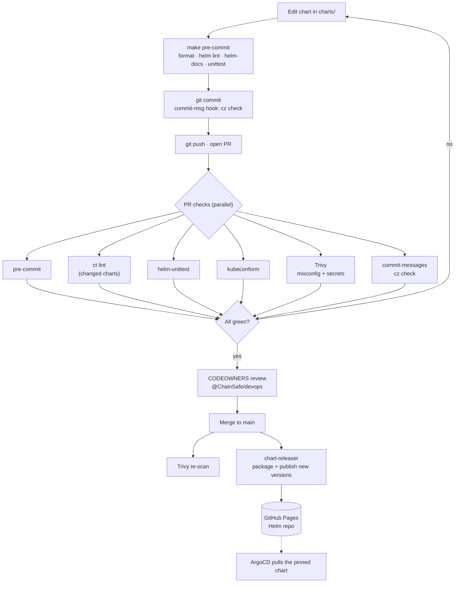

# Tooling & local setup

This explains **every tool in the stack** — what it does and when it runs — plus
how to work locally. For the step-by-step contribution flow, see
[../CONTRIBUTING.md](../CONTRIBUTING.md).

## TL;DR — the whole toolchain

| Tool | Job in one line | When |
|---|---|---|
| **Helm** | Templates → Kubernetes manifests; packages/versions the chart | everywhere |
| **helm-unittest** | Unit-tests the chart templates (asserts the rendered output) | PR + local |
| **chart-testing (`ct`)** | Lints charts: `Chart.yaml`, values, version bump | PR + local |
| **kubeconform** | Validates rendered manifests against Kubernetes schemas | PR + local |
| **helm-docs** | Generates each chart's `README.md` from `values.yaml` comments | pre-commit |
| **Trivy** | Security scan of the rendered chart (misconfig + secrets) | PR + push |
| **commitizen (`cz`)** | Enforces Conventional Commit messages | commit + PR |
| **pre-commit** | Runs the local hooks (formatting, helm lint, docs, cz, unittest) | commit + PR |
| **chart-releaser** | Packages + publishes charts to the Helm repo on merge to `main` | merge |
| **CODEOWNERS + branch protection** | Requires review before merge | always |

Each tool catches a specific class of mistake — see the detail below.

## Flow at a glance



## The tools, in detail

### Helm
The package manager. Our chart is `charts/generic-app` — one template per
Kubernetes kind, and each object's `spec`/`data` is spliced **verbatim** from a
values file. Every object is **off by default**; you turn it on with
`enabled: true`.

### helm-unittest — the real safety net
Runs the suites in `charts/generic-app/tests/`. Each test feeds the chart some
values and asserts the **exact rendered output** — so a future edit can't
silently change what the chart produces. This is what lets us refactor with
confidence.

Our current suites (13 tests):

| Suite (file) | What it proves |
|---|---|
| `deployments_test.yaml` | spec/labels/name spliced verbatim; default `apiVersion`; **empty map → 0 objects**; **no `enabled` → 0 objects** (off-by-default); `apiVersion` override honored |
| `services_test.yaml` | Service renders with default `apiVersion: v1` and verbatim ports |
| `configmaps_test.yaml` | inline `data` spliced; `dataFiles` injects a chart file into a data key |
| `externalsecrets_test.yaml` | `spec` spliced with default apiVersion; `templateFiles` injects a file into `target.template.data` and appends the monitoring block |
| `helpers_test.yaml` | the `monitoringConfig` helper renders into an injected file |
| `extraobjects_test.yaml` | `extraObjects` renders a structured (map) entry and a templated string; empty list → 0 objects |

Run: `make unittest`.

### chart-testing (`ct`)
Lints charts as a whole: valid `Chart.yaml`, well-formed values, and (optionally)
that the chart **version was bumped** when the chart changed. In CI we run
`ct list-changed` first, so it only lints charts touched by the PR.
Config: `ct.yaml`, `lintconf.yaml`. Run: `make lint`.

### kubeconform
`helm-unittest` proves we render *what we intended*; **kubeconform** proves that
output is *valid Kubernetes* — it checks rendered manifests against the K8s JSON
schemas (and the datree CRD catalog for CRDs like `ExternalSecret`). Catches
typo'd fields / wrong types that Helm happily emits. Script:
`scripts/kubeconform-check.sh`. Run: `make kubeconform`.

### helm-docs
Generates each chart's `README.md` from the `# --` comments in `values.yaml`.
The pre-commit hook fails if the committed README is stale, so docs can't drift
from the values. **Never hand-edit `charts/*/README.md`** — edit `values.yaml`
comments + `README.md.gotmpl` and run `make docs`.

### Trivy
Security scan. It renders the chart (via `TRIVY_HELM_VALUES` pointing at
`ci/example-values.yaml`) and scans for **misconfigurations** (e.g. containers
without a securityContext, writable root filesystem) **and committed secrets**,
failing on HIGH/CRITICAL. Config: `.trivy.yaml`.

### commitizen (`cz`)
Enforces **Conventional Commits** (`feat:`, `fix:`, `chore:` …). Two places:
a local `commit-msg` hook, and a CI job that checks every commit in the PR.
Why it matters: the commit type is what tells us the **version bump** (fix →
patch, feat → minor, breaking → major), which is the whole basis of how charts
get versioned and published. Config: `cz.toml`.

### pre-commit
The local hook runner. `make install-pre-commit` wires it in; `make pre-commit`
runs everything. Hooks: whitespace/EOF/merge-conflict fixers, `helm lint`,
`helm-docs`, `commitizen` (commit-msg), and `helm-unittest`. Same checks run in
CI, so "green locally" means "green in CI".

### chart-releaser
On merge to `main`, packages every chart whose version is new and publishes it
to our GitHub Pages Helm repo. Existing versions are skipped (immutable) — to
ship a change you **bump `version` in `Chart.yaml`**. See [chart-publishing.md](chart-publishing.md).

### CODEOWNERS + branch protection
`@ChainSafe/devops` must approve changes; `main` is protected so everything goes
through a reviewed PR.

## What runs when

| Stage | What happens |
|---|---|
| **Local commit** | pre-commit hooks (format, helm lint, helm-docs, cz, unittest) |
| **Pull request** | pre-commit · `ct lint` · helm-unittest · kubeconform · Trivy · commit-message check |
| **Merge to `main`** | Trivy (again) · chart-releaser packages + publishes new versions |

## Local setup

```bash
# one-time
brew install helm
helm plugin install https://github.com/helm-unittest/helm-unittest --version v0.6.2
make install-pre-commit      # wires pre-commit + commit-msg hooks

# day to day
make unittest                # run the chart tests
make lint                    # chart-testing lint
make kubeconform             # render + validate manifests
make docs                    # regenerate chart READMEs
make pre-commit              # run every hook, as CI does
```

(`make lint`, `make docs`, and Trivy use Docker images, so Docker needs to be
running for those.)

## Adding a new chart

See [chart-authoring.md](chart-authoring.md).
